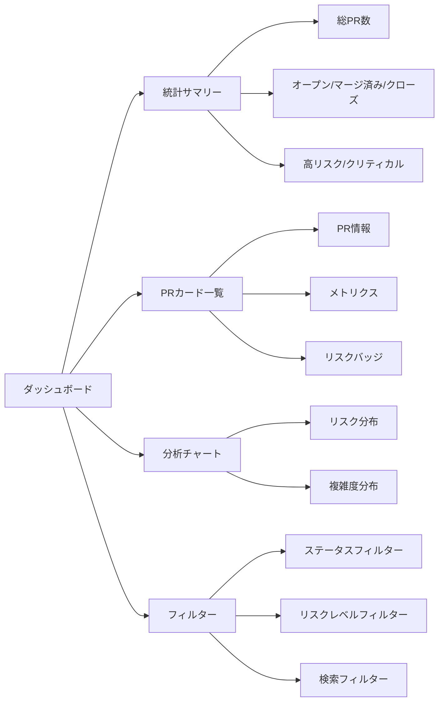
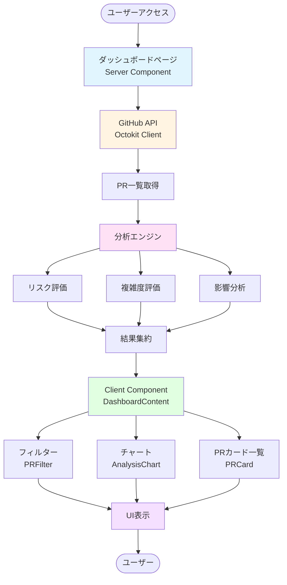
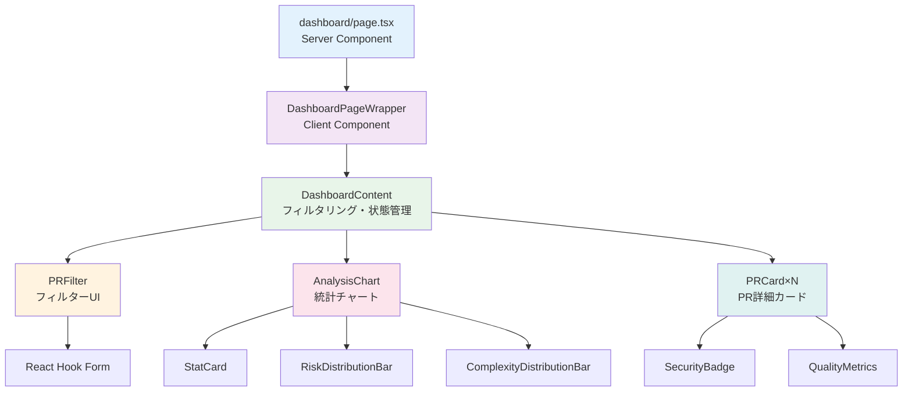
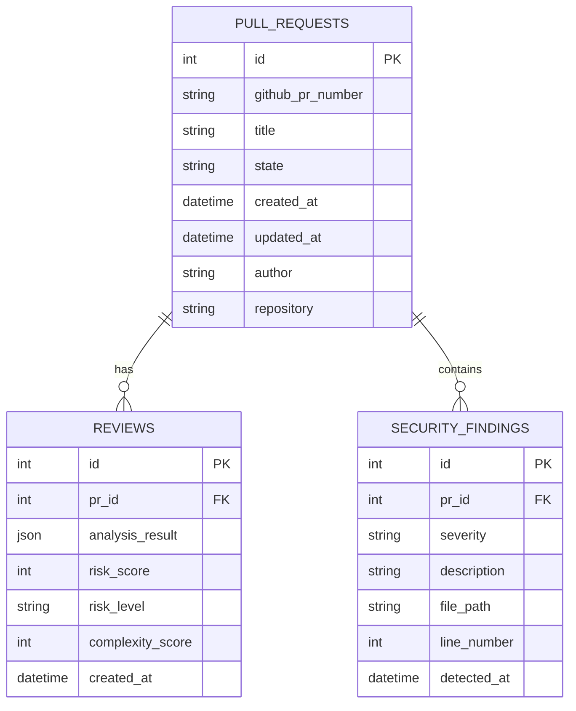

# 🔍 Code Review Dashboard

<div align="center">


### GitHub Pull Requestを自動分析し、コード品質とセキュリティを評価するインテリジェントダッシュボード

[📖 ドキュメント](./DASHBOARD_IMPLEMENTATION.md) • [🚀 クイックスタート](./QUICKSTART.md) • [🤝 コントリビューション](#-contributing)

</div>

---

## 📋 目次

- [概要](#-概要)
- [主な機能](#-主な機能)
- [技術スタック](#%EF%B8%8F-技術スタック)
- [システムアーキテクチャ](#%EF%B8%8F-システムアーキテクチャ)
- [環境構築](#-環境構築)
- [使い方](#-使い方)
- [プロジェクト構成](#-プロジェクト構成)
- [ライセンス](#-ライセンス)

---

## 🎯 概要

Code Review Dashboardは、GitHubのPull Requestを自動的に分析し、コード品質、セキュリティリスク、複雑度を評価するNext.js製のWebアプリケーションです。

### 特徴

- ✅ **リアルタイム分析**: GitHub APIと連携してPRデータを取得・分析
- 🎨 **直感的なUI**: Tailwind CSSによるレスポンシブデザイン
- 📊 **可視化**: メトリクスとチャートによる分析結果の可視化
- 🔍 **フィルタリング**: ステータス、リスクレベル、検索による柔軟なフィルタリング
- 🚀 **高性能**: Server Componentsによる最適化とキャッシング
- 🔒 **セキュア**: 環境変数による安全な認証管理

---

## ⚡ 主な機能

### 1. PR分析エンジン

- **複雑度評価**: 変更行数、ファイル数から複雑度を算出
- **リスク評価**: クリティカルファイル、変更規模からリスクレベルを判定
- **影響分析**: 変更されたディレクトリと影響範囲を特定

### 2. ダッシュボードUI



### 3. メトリクス表示

| メトリクス | 説明 |
|-----------|------|
| リスクスコア | 0-100の数値でリスクレベルを評価 |
| 複雑度スコア | コード変更の複雑さを数値化 |
| 変更ファイル数 | PRで変更されたファイルの総数 |
| 変更行数 | 追加・削除された行の合計 |
| リスクレベル | 低・中・高・クリティカルの4段階 |

### 4. 自動ラベル付与（GitHub Actions）

PRに自動的にラベルを付与し、レビュープロセスを効率化:

- 🟢 **low-risk**: リスクレベル: 低
- 🟡 **medium-risk**: リスクレベル: 中
- 🔴 **high-risk**: リスクレベル: 高
- 🚨 **critical-risk**: リスクレベル: 緊急
- 📊 **large-changes**: 大規模な変更
- ⚠️ **critical-files-modified**: クリティカルファイル変更

---

## 🛠️ 技術スタック

### フロントエンド

<div align="center">

<table>
<tr>
<td align="center" width="150">
<br />
<strong>Next.js</strong><br />
16.0.10
</td>
<td align="center" width="150">
<br />
<strong>React</strong><br />
19.2.0
</td>
<td align="center" width="150">
<br />
<strong>TypeScript</strong><br />
5.x
</td>
<td align="center" width="150">
<br />
<strong>Tailwind CSS</strong><br />
4.x
</td>
</tr>
</table>

</div>

### ライブラリ

<div align="center">

| ライブラリ | 用途 | ロゴ |
|-----------|------|------|
| **React Hook Form** | フォーム管理 |  |
| **Zod** | バリデーション |  |
| **Lucide React** | アイコン |  |
| **date-fns** | 日付処理 |  |
| **Octokit** | GitHub API |  |

</div>

### バックエンド・インフラ

<div align="center">

| 技術 | 用途 | ロゴ |
|------|------|------|
| **NextAuth.js** | 認証 |  |
| **GitHub Actions** | CI/CD |  |
| **Vercel** | デプロイ |  |

</div>

---

## 🏗️ システムアーキテクチャ

### データフロー図



### コンポーネント構成



### データベーススキーマ（将来対応）



---

## 🚀 環境構築

### 前提条件

- Node.js 20.x以上
- npm / yarn / pnpm / bun
- GitHubアカウント（Personal Access Token必要）

### 1. リポジトリのクローン

```bash
git clone https://github.com/hideaki1979/claudecode_codereview.git
cd code-review-dashboard
```

### 2. 依存関係のインストール

```bash
npm install
# または
yarn install
# または
pnpm install
```

### 3. 環境変数の設定

`.env.local` ファイルを作成:

```bash
# GitHub API用のトークン
GITHUB_TOKEN="your_github_token_here"

# API認証用のキー（サーバーサイド）
API_KEY="your_api_key_here"

# API認証用のキー（クライアントサイド）
NEXT_PUBLIC_API_KEY="your_api_key_here"
```

#### GitHub Personal Access Tokenの取得方法

1. GitHubにログイン
2. Settings → Developer settings → Personal access tokens → Tokens (classic)
3. "Generate new token (classic)" をクリック
4. 必要なスコープを選択:
   - `repo` (フルアクセス)
   - `read:org` (組織のPRを読む場合)
5. トークンを生成してコピー

### 4. 開発サーバーの起動

```bash
npm run dev
```

ブラウザで [http://localhost:3000/dashboard](http://localhost:3000/dashboard) を開く

### 5. プロダクションビルド

```bash
npm run build
npm run start
```

---

## 📖 使い方

### 基本的な使い方

1. **ダッシュボードにアクセス**: [http://localhost:3000/dashboard](http://localhost:3000/dashboard)
2. **リポジトリ設定**: `src/app/dashboard/DashboardPageWrapper.tsx` で対象リポジトリを設定
3. **PRを確認**: 一覧からPRを選択してメトリクスを確認
4. **フィルタリング**: ステータス、リスクレベル、検索でPRを絞り込み

### リポジトリの変更方法

`src/app/dashboard/DashboardPageWrapper.tsx` の55-56行目を編集:

```typescript
const { data: prs } = await listPullRequests({
  owner: 'your-username',  // ← ここを変更
  repo: 'your-repo',       // ← ここを変更
  state: 'all',
  per_page: 20,
});
```

### GitHub Actionsの設定

PRへの自動ラベル付与を有効にする:

1. `.github/workflows/analyze-pr.yml` が既に設定済み
2. GitHubリポジトリの Settings → Secrets → Actions で `GITHUB_TOKEN` を設定
3. PRを作成すると自動的に分析・ラベル付与が実行される

---

## 📁 プロジェクト構成

```plaintext
code-review-dashboard/
├── .github/
│   ├── scripts/
│   │   └── analyze-and-label.js    # PR分析・ラベル付与スクリプト
│   └── workflows/
│       └── analyze-pr.yml          # GitHub Actions設定
├── src/
│   ├── app/
│   │   ├── api/                    # APIエンドポイント
│   │   ├── dashboard/              # ダッシュボードページ
│   │   │   ├── page.tsx            # メインページ (Server Component)
│   │   │   ├── DashboardPageWrapper.tsx  # データ取得ラッパー
│   │   │   ├── DashboardContent.tsx      # フィルタリング (Client Component)
│   │   │   ├── loading.tsx         # ローディング状態
│   │   │   └── error.tsx           # エラー状態
│   │   └── layout.tsx              # ルートレイアウト
│   ├── components/
│   │   ├── AnalysisChart.tsx       # 分析チャート
│   │   ├── PRCard.tsx              # PRカード
│   │   └── PRFilter.tsx            # フィルターコンポーネント
│   ├── lib/
│   │   ├── analysis/               # 分析ロジック
│   │   │   ├── index.ts            # 分析エンジン
│   │   │   ├── complexity.ts       # 複雑度評価
│   │   │   ├── risk.ts             # リスク評価
│   │   │   └── impact.ts           # 影響分析
│   │   ├── github/                 # GitHub API統合
│   │   │   ├── client.ts           # Octokitクライアント
│   │   │   └── api.ts              # API関数
│   │   └── utils.ts                # ユーティリティ関数
│   └── types/
│       ├── analysis.ts             # 分析型定義
│       ├── dashboard.ts            # ダッシュボード型定義
│       └── github.ts               # GitHub API型定義
├── public/                         # 静的ファイル
├── agent_docs/                     # エージェントドキュメント
├── DASHBOARD_IMPLEMENTATION.md     # 実装ドキュメント
├── QUICKSTART.md                   # クイックスタートガイド
└── README.md                       # このファイル
```

### 主要ディレクトリの説明

| ディレクトリ | 説明 |
|-------------|------|
| `src/app/` | Next.js App Routerのページとレイアウト |
| `src/components/` | 再利用可能なReactコンポーネント |
| `src/lib/` | ビジネスロジックとユーティリティ |
| `src/types/` | TypeScript型定義 |
| `.github/` | GitHub Actions設定とスクリプト |

---

## 🧪 テスト・ビルド

### 型チェック

```bash
npx tsc --noEmit
```

### リント

```bash
npm run lint
```

### プロダクションビルド

```bash
npm run build
```

---

## 🤝 Contributing

貢献は大歓迎です！以下の手順でコントリビュートできます:

1. このリポジトリをフォーク
2. フィーチャーブランチを作成 (`git checkout -b feature/amazing-feature`)
3. 変更をコミット (`git commit -m 'Add amazing feature'`)
4. ブランチにプッシュ (`git push origin feature/amazing-feature`)
5. プルリクエストを作成

### コーディング規約

- TypeScriptの型を明示的に記述
- Server ComponentsとClient Componentsを適切に使い分け
- Tailwind CSSユーティリティクラスを使用
- ESLintルールに従う

---

## 📝 ライセンス

このプロジェクトはMITライセンスの下で公開されています。詳細は [LICENSE](./LICENSE) ファイルを参照してください。

---

## 📚 関連ドキュメント

- [📖 実装ドキュメント](./DASHBOARD_IMPLEMENTATION.md) - 詳細な技術仕様
- [🚀 クイックスタートガイド](./QUICKSTART.md) - すぐに始める方法
- [🏗️ アーキテクチャガイド](./agent_docs/architecture.md) - システム設計
- [🔒 セキュリティ要件](./agent_docs/security_requirements.md) - セキュリティ仕様

---

## 💬 サポート

質問や問題がある場合は、[Issues](https://github.com/hideaki1979/claudecode_codereview/issues)で報告してください。

---

<div align="center">

**Made with ❤️ using Next.js 16 & React 19**

<br/>


</div>
